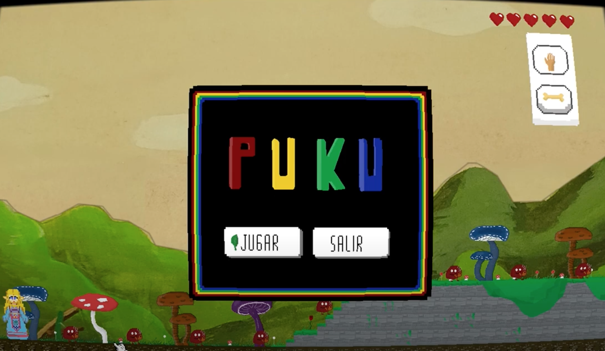
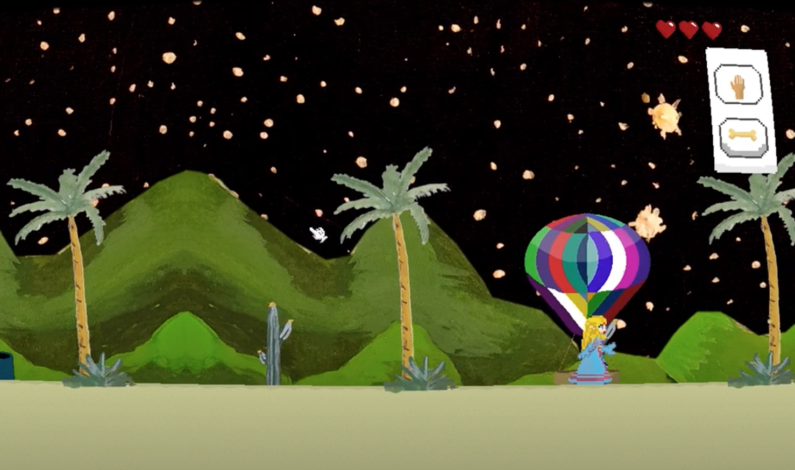
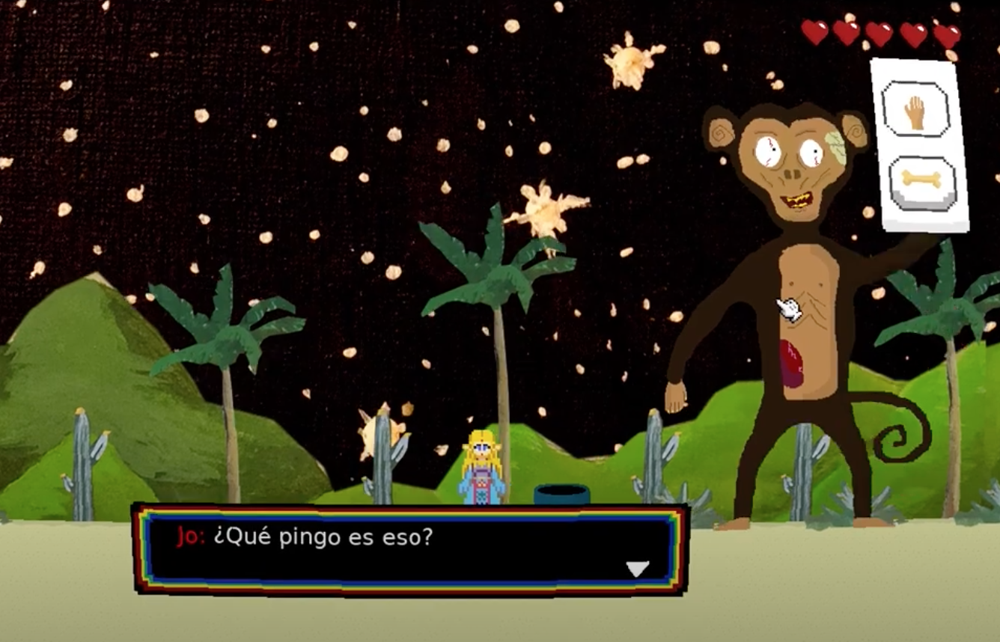
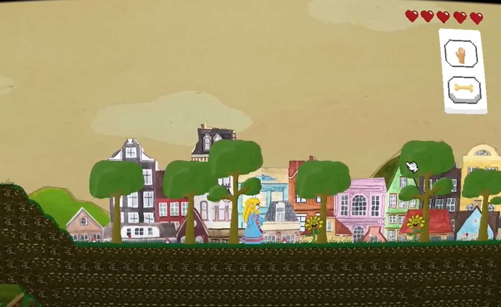

# Puku

##




## Folder structure
```
.
├── assets
│   ├── backgrounds
│   ├── entities
│   ├── levels
│   ├── sound
│   └── tiles
├── dialogs
│   └── dialogLevel1.lua
├── entities
│   ├── Entities.lua
│   ├── Entity.lua
│   ├── deadScreen.lua
│   ├── dialog.lua
│   ├── dog.lua
│   ├── endScreen.lua
│   ├── flower.lua
│   ├── globe.lua
│   ├── life.lua
│   ├── monkeyBoss.lua
│   ├── mouse.lua
│   ├── mouseControl.lua
│   ├── player.lua
│   ├── puku.lua
│   ├── pukuCounter.lua
│   ├── pukuGrown.lua
│   ├── startScreen.lua
│   └── zombie.lua
├── gamestates
│   ├── LevelBase.lua
│   ├── gameLevel1.lua
│   ├── gameLevel2.lua
│   ├── mainMenu.lua
│   └── pause.lua
├── icon.icns
├── libs
│   ├── anim8
│   ├── bump
│   ├── camera.lua
│   ├── hump
│   ├── moonshine
│   └── sti
└── main.lua
``` 
